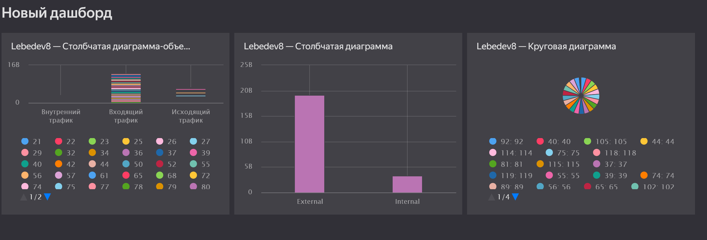

## Цель работы

1.  Изучить возможности технологии Yandex DataLens для визуального анализа
    структурированных наборов данных

2.  Получить навыки визуализации данных для последующего анализа с помощью сервисов
    Yandex Cloud

3.  Получить навыки создания решений мониторинга/SIEM на базе облачных продуктов и
    открытых программных решений

4.  Закрепить практические навыки использования SQL для анализа данных сетевой
    активности в сегментированной корпоративной сети

## Исходные данные

1.  Программное обеспечение ОС Windows 11 Home

2.  RStudio

3.  Доступ к экосистеме Yanex Query

## План

1.  Составить Dashboard

## Шаги:

```{r}
sessionInfo()
```

### Ход выполнения, составлен дашбоард





## Оценка результата

В рамках практческой работы были изучены возможности Yandex Datalens для
визуализации данных.

## Вывод

В практической работе были изучены возможности технологии Yandex Datalens для
анализа структурированных наборов данных и получены навыки создания визуализаций в
данной системе.